# ontop-aether（天织）

基于 [Ontop](https://ontop-vkg.org/) 的语义数据平台，提供本体管理、OBDA 映射编辑、SPARQL 查询、AI 自然语言查询和平台治理能力。对标 Microsoft Fabric IQ 本体管理功能，纯 Ontop 驱动，无需 Protégé。

> **定位**：虚拟知识图谱全栈工作台
> **仓库**：git@github.com:wank125/ontop-aether.git

## 核心工作流

```
连接数据源 → 分析结构 → Bootstrap 生成映射 → SPARQL / AI 查询
```

## 功能模块

| 模块 | 路由 | 说明 |
|------|------|------|
| 数据源管理 | `/datasource` | JDBC 连接 CRUD、测试连接、Schema 探查、Bootstrap |
| 数据库概览 | `/db-schema` | 表结构、外键、主键浏览 |
| SPARQL 查询 | `/sparql` | 查询编辑器、SQL reformulate、历史记录 |
| 映射编辑 | `/mapping` | .obda 文件读写、验证、端点重启 |
| AI 助手 | `/ai-assistant` | 自然语言 → SPARQL，流式返回 |
| 本体可视化 | `/ontology` | OWL 类/属性解析、Vis.js 图谱 |
| 语义标注 | `/annotations` | LLM 标注审核 + 合并到 TTL |
| 业务词汇表 | `/glossary` | 业务词 → 本体 URI 映射，注入 AI Prompt |
| 本体精化 | `/refinement` | AI 精化建议（6 种类型）自动应用 |
| AI 设置 | `/settings` | 8 种 LLM Provider、模型、提示词配置 |
| 数据发布 | `/publishing` | API Key、MCP Server、工具定义生成 |
| 平台治理 | `/governance` | RBAC、API Key（`oak_`）、审计日志 |
| 系统设置 | `/system` | 用户信息、服务状态、端点状态 |

## 页面预览

<table>
  <tr>
    <td align="center"><b>首页工作台</b></td>
    <td align="center"><b>数据源管理</b></td>
    <td align="center"><b>数据库概览</b></td>
  </tr>
  <tr>
    <td></td>
    <td>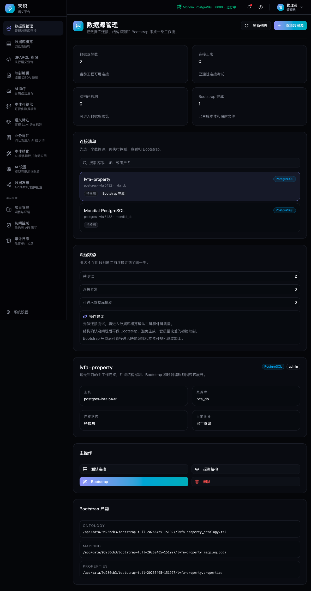</td>
    <td>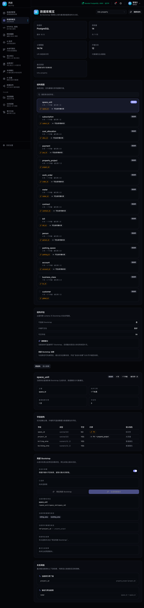</td>
  </tr>
  <tr>
    <td align="center"><b>SPARQL 查询</b></td>
    <td align="center"><b>映射编辑</b></td>
    <td align="center"><b>AI 助手</b></td>
  </tr>
  <tr>
    <td>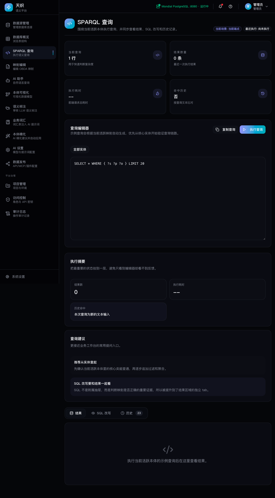</td>
    <td>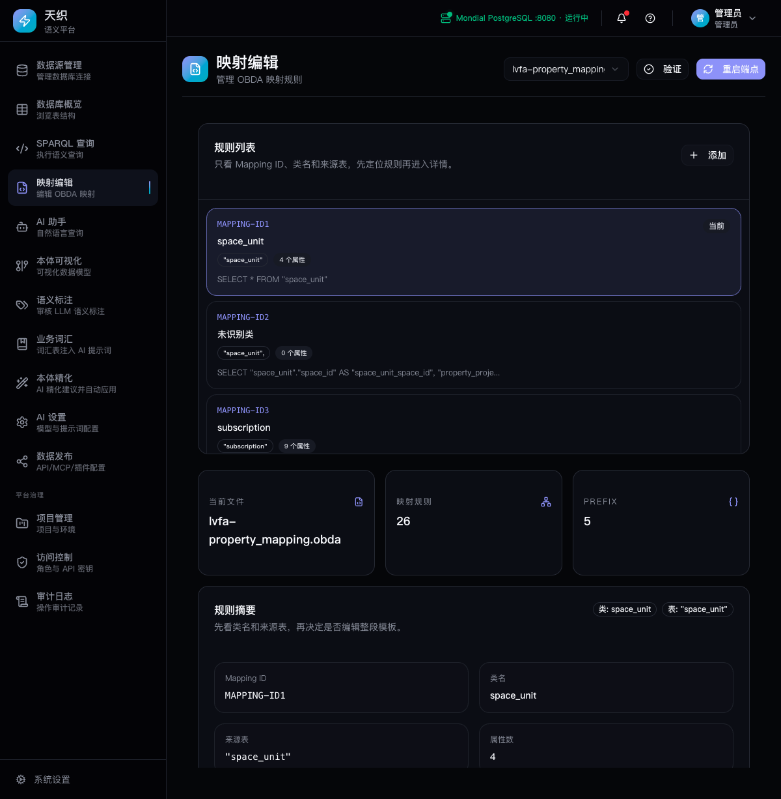</td>
    <td>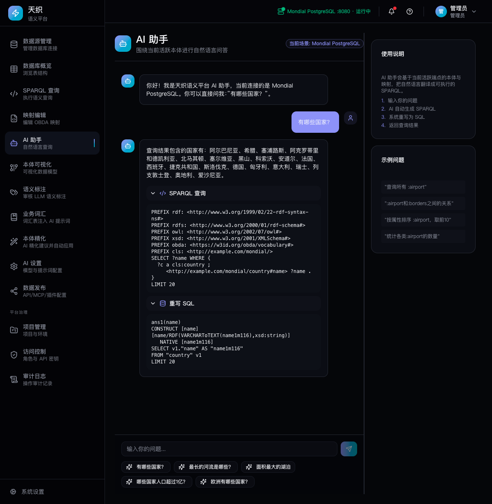</td>
  </tr>
  <tr>
    <td align="center"><b>本体可视化</b></td>
    <td align="center"><b>AI 设置</b></td>
    <td align="center"><b>系统设置</b></td>
  </tr>
  <tr>
    <td>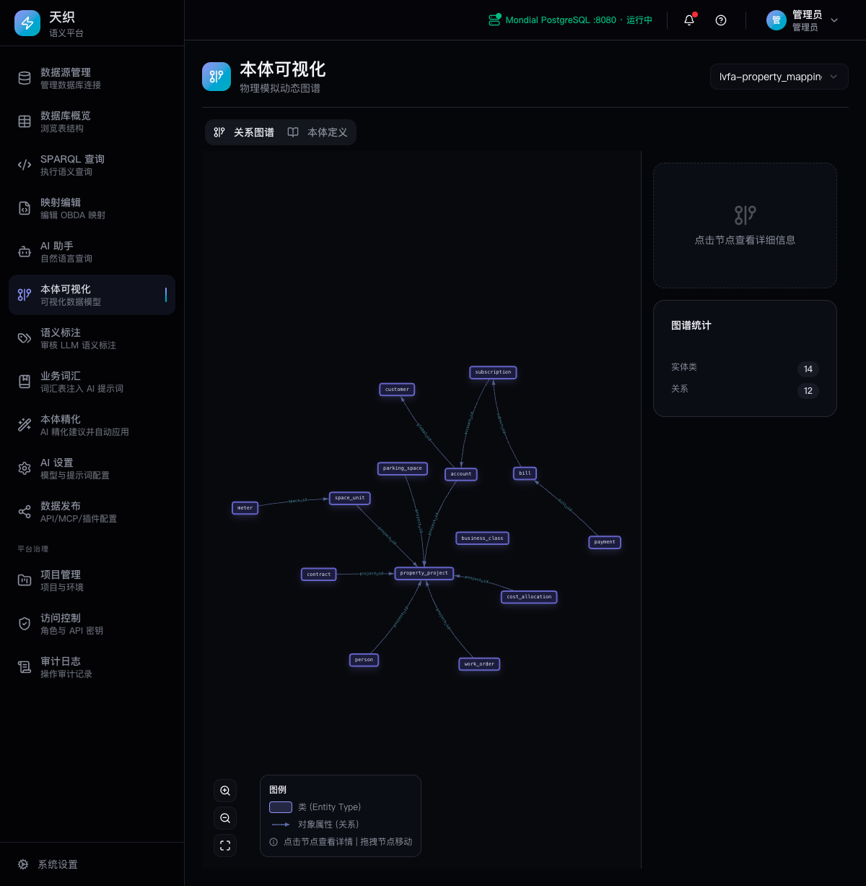</td>
    <td>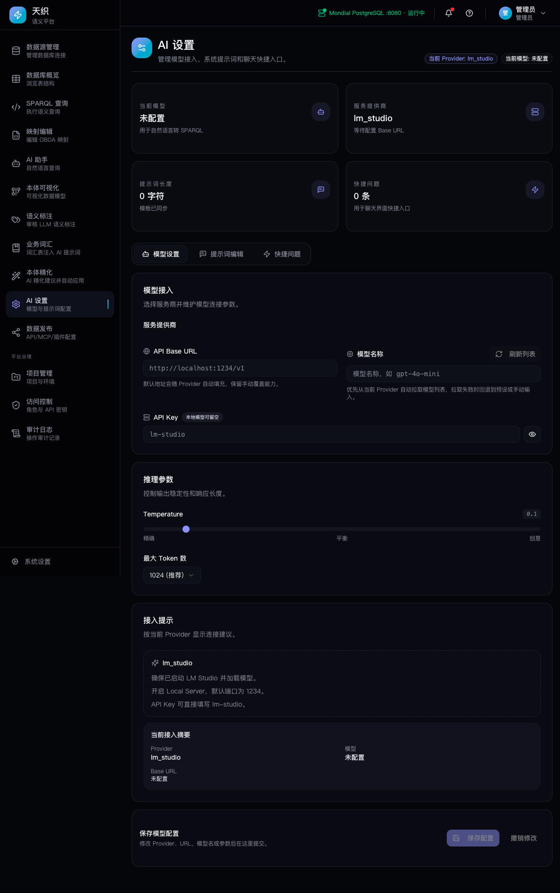</td>
    <td>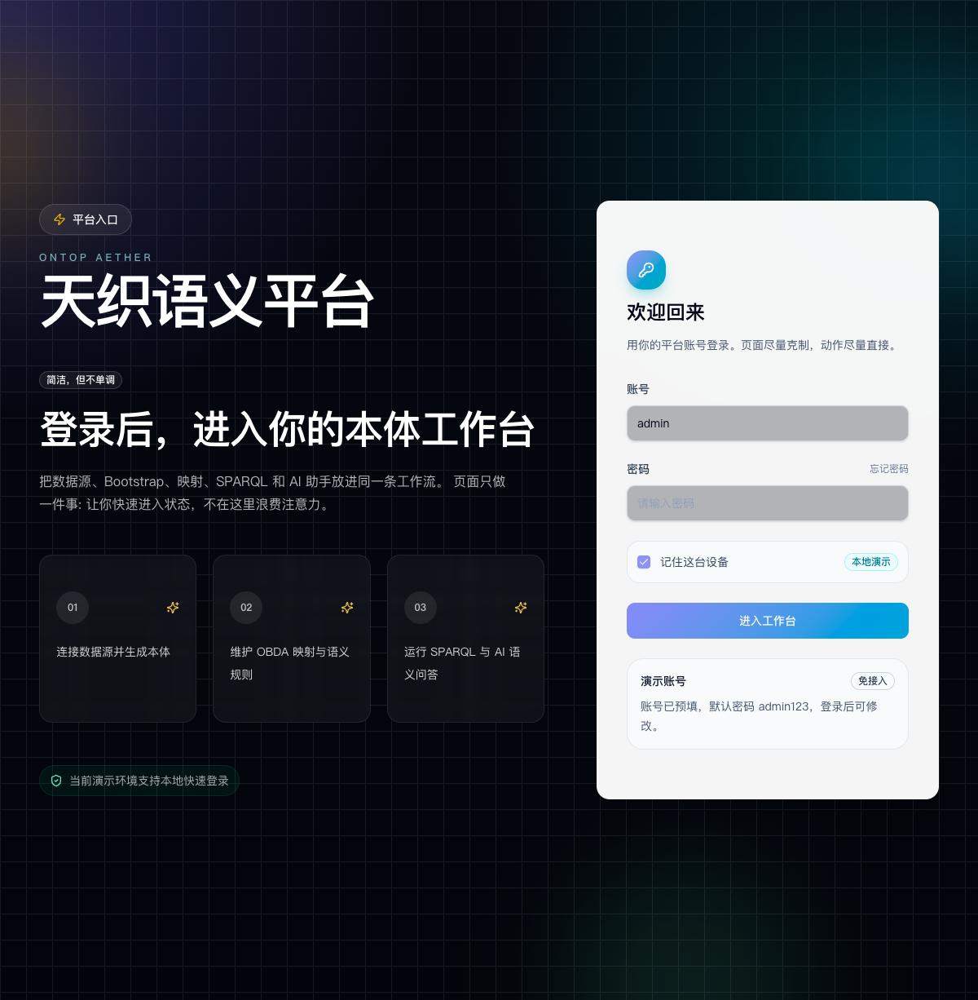</td>
  </tr>
  <tr>
    <td align="center"><b>语义标注</b></td>
    <td align="center"><b>业务词汇表</b></td>
    <td align="center"><b>本体精化</b></td>
  </tr>
  <tr>
    <td>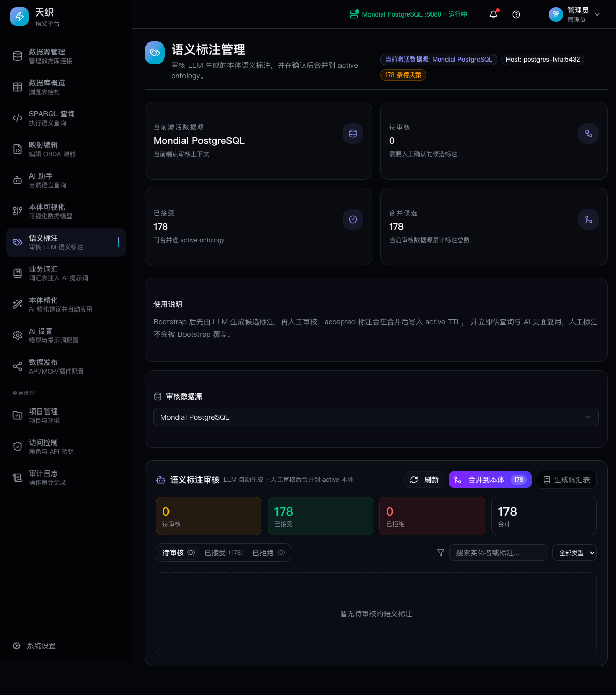</td>
    <td>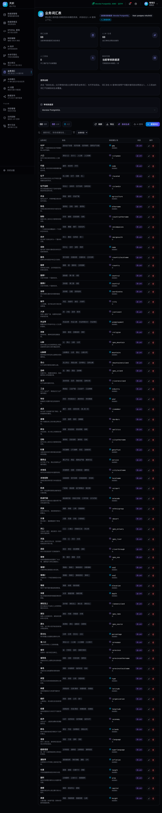</td>
    <td>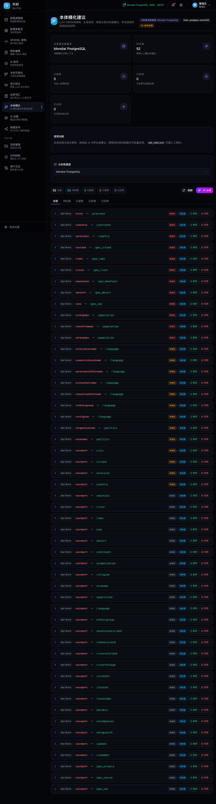</td>
  </tr>
  <tr>
    <td align="center"><b>数据发布</b></td>
    <td></td>
    <td></td>
  </tr>
  <tr>
    <td>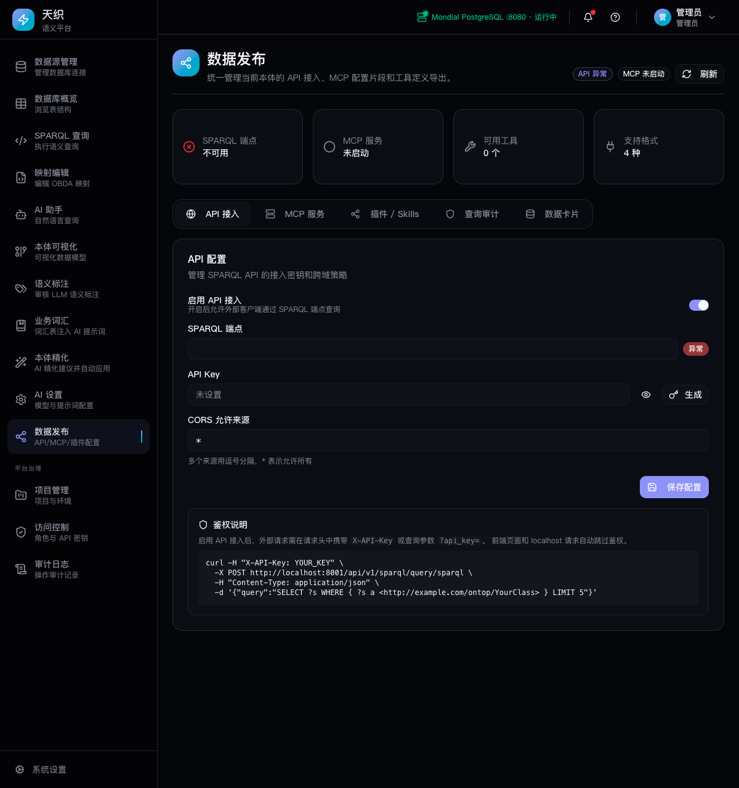</td>
    <td></td>
    <td></td>
  </tr>
</table>

## 双后端架构

前端 `server.ts` 根据路径自动路由到不同后端：

| 路径 | 后端 | 说明 |
|------|------|------|
| `/api/v1/datasources` (CRUD) | Java | 数据源管理、测试连接、Schema |
| `/api/v1/datasources/*/bootstrap` | Python | Bootstrap 需要 LLM |
| `/api/v1/endpoint-registry` | Java | 端点注册表、数据源切换 |
| `/api/v1/mappings` | Java | 映射文件读写、验证 |
| `/api/v1/ontology` | Java | TTL 文件解析（OWLAPI） |
| `/api/v1/sparql/*` | Java | SPARQL 代理 + 查询历史 |
| `/api/v1/auth/*` | Python | 认证 |
| `/api/v1/ai/*` | Python | AI 自然语言查询 |
| `/api/v1/annotations/*` | Python | 语义标注 |
| `/api/v1/glossary/*` | Python | 业务词汇表 |
| `/api/v1/suggestions/*` | Python | 本体精化建议 |
| `/api/v1/governance/*` | Python | 平台治理（RBAC / 审计） |
| `/api/v1/publishing/*` | Python | 数据发布（API / MCP） |

### 服务职责

| 服务 | 职责 | 技术栈 |
|------|------|--------|
| ontop-engine | 数据源 CRUD、端点切换、映射读写、TTL 解析、SPARQL 代理 | Spring Boot + JdbcTemplate + OWLAPI |
| ontop-backend | Bootstrap 编排、AI/LLM 查询、标注、词汇表、精化、治理、认证 | FastAPI + OpenAI SDK |
| ontop-endpoint | SPARQL 查询执行、SQL reformulate | Ontop 5.5.0 |

### SQLite 共享

Java 和 Python 共享同一 SQLite 文件（WAL 模式）：

- Java 管理：datasources, endpoint_registry, query_history
- Python 管理：ai_config, annotations, glossary, users, sessions, suggestions, publishing, 治理表
- 密码 Fernet 加密（Java 纯 JDK 实现，与 Python 零迁移兼容）

## 技术栈

| 层 | 技术 |
|---|---|
| 前端 | Next.js 16 + React 19 + TypeScript + Tailwind CSS 4 + shadcn/ui |
| 后端（业务） | Python FastAPI + httpx + OpenAI SDK + SQLite |
| 引擎（CRUD） | Java 17 + Spring Boot 2.7 + JdbcTemplate + OWLAPI + SQLite |
| 端点 | Ontop 5.5.0 SPARQL Endpoint（Spring Boot 原生） |
| MCP | Model Context Protocol SDK (Python mcp>=1.0.0) |
| LLM | OpenAI 兼容 API（LM Studio / Ollama / DeepSeek 等） |
| 数据库 | PostgreSQL 16 / MySQL 8 |
| 部署 | Docker Compose 5 容器编排 |

## 项目结构

```
ontop-aether/
├── ontop-ui/                     # Next.js 前端
│   ├── src/app/                  # 页面路由（14 个页面）
│   ├── src/components/           # UI 组件 + shadcn/ui
│   ├── src/lib/api.ts            # API 客户端
│   ├── src/lib/auth.tsx          # 认证管理
│   └── src/server.ts             # Node 服务 + API 路由代理
├── ontop-backend/                # FastAPI 后端（AI/LLM/标注/词汇表/治理）
│   ├── main.py                   # 应用入口
│   ├── database.py               # SQLite 初始化 + 15+ 表
│   ├── routers/                  # API 路由
│   ├── services/                 # 业务逻辑
│   ├── repositories/             # 数据访问层
│   └── models/                   # Pydantic 模型
├── ontop-engine/                 # Spring Boot 引擎（CRUD/映射/SPARQL 代理）
│   └── src/main/java/.../ontopengine/
│       ├── api/                  # 5 个 REST 控制器（23 端点）
│       ├── service/              # 6 个业务服务
│       ├── repository/           # 3 个 JdbcTemplate 数据访问
│       ├── model/                # 12 个 DTO
│       └── config/               # SQLite + RestTemplate + Fernet 加密
├── ontop-endpoint/               # Ontop SPARQL Endpoint
├── ontop-db/                     # 数据库初始化脚本（PostgreSQL / MySQL）
├── ontop-output/                 # 共享产物（.ttl, .obda, .properties）
├── docs/                         # 文档
├── docker-compose.yml            # 默认 retail 环境
├── docker-compose.lvfa.yml       # LVFA / Mondial 演示环境
└── docker-compose.mysql.yml      # MySQL 电商演示环境
```

## 快速启动

### 前置条件

- Docker & Docker Compose
- LM Studio 或其他 OpenAI 兼容服务（AI 查询功能，可选）

### Docker 部署

```bash
# LVFA / Mondial 演示环境（推荐）
docker compose -f docker-compose.lvfa.yml up -d --build

# 默认 retail 环境
docker compose up -d --build

# MySQL 演示环境
docker compose -f docker-compose.mysql.yml up -d --build
```

访问地址：

| 环境 | 前端 | 后端 API | 引擎 | SPARQL 端点 | PostgreSQL |
|------|------|----------|------|-------------|------------|
| LVFA | :3001 | :8001/docs | :8083 | :18081 | :5436 |
| Retail | :3000 | :8000/docs | :8081 | :18080 | :5433 |
| MySQL | :3002 | :8002/docs | :8084 | :18082 | :3307 |

默认登录账号：`admin` / `admin123`

### 本地开发

```bash
# Java 引擎
cd ontop-engine && mvn spring-boot:run

# Python 后端
cd ontop-backend && pip install -r requirements.txt
python3 -m uvicorn main:app --port 8000 --reload

# 前端
cd ontop-ui && pnpm install && pnpm dev
```

### 环境变量

| 变量 | 默认值 | 说明 |
|------|--------|------|
| `BACKEND_URL` | `http://localhost:8000` | Python 后端地址（前端使用） |
| `ENGINE_URL` | `http://localhost:8081` | Java 引擎地址（前端使用） |
| `SQLITE_DB_PATH` | `/app/data/ontop_ui.db` | SQLite 数据库路径 |
| `ENCRYPTION_KEY_PATH` | `/app/data/.encryption_key` | Fernet 加密密钥路径 |
| `ONTOP_ENDPOINT_URL` | `http://localhost:8080` | SPARQL 端点地址 |
| `LLM_BASE_URL` | `http://localhost:1234/v1` | LLM API 地址 |
| `LLM_MODEL` | `zai-org/glm-4.7-flash` | LLM 模型名 |

## MCP Server 外部接入

MCP Server 通过 Streamable HTTP 模式暴露：

### Claude Desktop

```json
{
  "mcpServers": {
    "ontop-semantic": {
      "url": "http://localhost:8001/mcp/mcp"
    }
  }
}
```

### Cursor / Windsurf

```
http://localhost:8001/mcp/mcp
```

## 许可证

本项目仅供研究学习使用。Ontop 本身为 Apache 2.0 许可。
