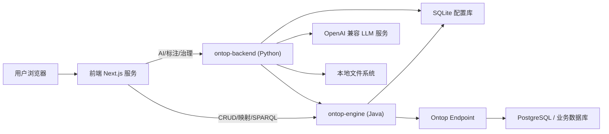
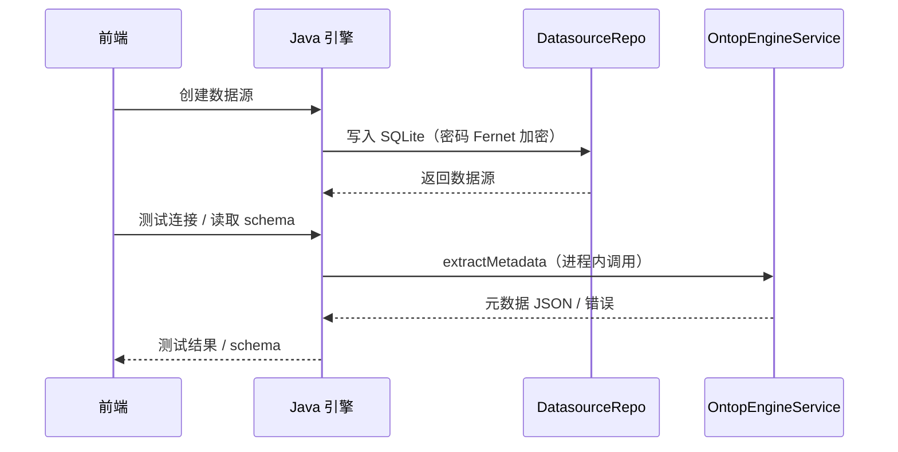
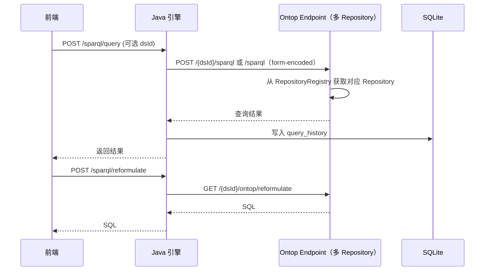
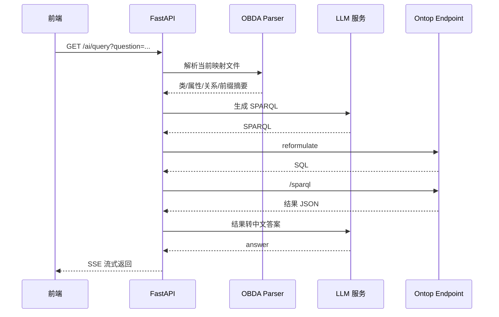

# 天织 ontop-aether 架构设计

## 1. 文档目的

本文档描述 `ontop-aether` 的整体技术架构、核心组件职责、关键数据流、部署模型和主要设计约束，作为后续开发、联调、运维和演进的基础参考。

本文档基于当前代码实现整理，范围覆盖：

- 前端应用架构
- 双后端服务架构（Java + Python）
- Ontop 集成架构
- 数据存储架构
- AI 查询链路
- 平台治理
- 部署与运行方式

## 2. 设计目标

系统的核心目标是围绕 Ontop 构建一个虚拟知识图谱工作台，支撑以下能力：

- 管理关系数据库连接
- 自动从关系库生成本体与映射
- 编辑和验证 OBDA 映射
- 对 Ontop Endpoint 执行 SPARQL 查询
- 将自然语言转换为 SPARQL 并生成答案
- 将本体结构和约束进行可视化展示
- 语义注释层、业务词汇表、本体精化建议
- API Key 鉴权保护外部访问
- 多数据源端点注册与切换

设计原则：

- 以 Ontop 为中心，不自建查询引擎
- 前后端职责清晰，前端只做交互和展示
- 双后端架构：Java 引擎处理 CRUD/映射/SPARQL 代理，Python 后端处理 AI/LLM/治理
- 尽量使用本地文件和轻量 SQLite，降低部署复杂度
- 支持 Docker 演示环境和本地开发模式两种运行形态
- Java 和 Python 共享 SQLite（WAL 模式），各自管理不同表

## 3. 总体架构

系统由五个核心层组成：

- 表现层：Next.js 前端（含 API 路由代理）
- 应用服务层（Python）：FastAPI 后端，处理 AI/LLM/标注/词汇表/治理/认证
- 引擎服务层（Java）：Spring Boot 引擎，处理数据源 CRUD/映射读写/TTL 解析/SPARQL 代理
- 语义执行层：Ontop Endpoint（SPARQL 查询执行）
- 数据与配置层：PostgreSQL + SQLite + 文件系统



## 4. 逻辑分层

### 4.1 前端层

前端位于 `ontop-ui/`，采用：

- Next.js 16
- React 19
- TypeScript
- Tailwind CSS 4
- shadcn/ui

前端职责：

- 提供页面路由和交互界面
- 调用后端 API
- 呈现 SPARQL、映射、本体、AI 结果
- 在 Node 侧代理 `/api/*` 请求到 Java 引擎或 Python 后端（根据路径自动分流）

前端不承担以下职责：

- 不直接访问数据库
- 不直接管理本地持久化配置

### 4.2 Java 引擎层

Java 引擎位于 `ontop-engine/`，采用：

- Spring Boot 2.7
- JdbcTemplate（无 JPA）
- OWLAPI（TTL 解析）
- SQLite JDBC

Java 引擎职责：

- 数据源 CRUD（8 端点）
- 端点注册表与数据源切换（3 端点）
- 映射文件读写与验证（5 端点）
- TTL 本体文件解析（2 端点）
- SPARQL 查询代理 + 查询历史（5 端点）
- Fernet 加密（与 Python 零迁移兼容）

### 4.3 Python 后端层

Python 后端位于 `ontop-backend/`，采用：

- FastAPI
- Pydantic v2
- httpx
- OpenAI SDK
- SQLite

Python 后端职责：

- Bootstrap 编排（调用 Java 引擎 + LLM）
- AI 自然语言查询（SSE 流式）
- 语义标注管理 + 合并到 TTL
- 业务词汇表管理 + AI 推导
- 本体精化建议生成与应用
- 平台治理（RBAC / API Key / 审计）
- 用户认证与会话管理
- 数据发布（API / MCP / Tools）
- 调用 Java 引擎完成 extract-metadata / bootstrap / validate

### 4.4 语义执行层

该层为独立的 Ontop Endpoint Docker 容器（v0.3.0 起支持多 Repository），提供：

- `/{dsId}/sparql`：按数据源 ID 路由的 SPARQL 查询执行（零切换时间）
- `/sparql`：使用当前激活数据源的 SPARQL 查询（向后兼容）
- `/{dsId}/ontop/reformulate`：按数据源 SQL reformulate
- `/ontop/reformulate`：当前激活数据源的 reformulate（向后兼容）
- `/ontop/restart`：重启当前激活 Repository
- `/api/v1/repositories`：Repository 管理 API（注册/注销/激活/重启/健康检查）

核心组件：
- `RepositoryRegistry`：ConcurrentHashMap 管理多个 `OntopVirtualRepository` 实例
- `RepositoryEntry`：单个 Repository 的元数据 + 实例引用
- 启动时自动从 `ontop.repos-dir` 目录加载数据源

与 Java 引擎通过 HTTP 交互，由 Java SPARQL 代理转发查询。

### 4.4 存储层

存储层拆分为三类：

- 业务数据库：外部 PostgreSQL/MySQL/Oracle/SQL Server
- 配置数据库：SQLite
- 文件存储：`.ttl`、`.obda`、`.properties`、日志、manifest

## 5. 目录架构

```text
ontop-aether/
├── ontop-ui/                     # Next.js 前端
│   ├── src/app/                  # 页面路由
│   ├── src/components/           # UI 组件
│   ├── src/lib/api.ts            # API 客户端
│   └── src/server.ts             # API 路由代理（分流到 Java/Python）
├── ontop-backend/                # FastAPI 后端（AI/LLM/标注/治理）
│   ├── main.py
│   ├── routers/
│   ├── services/
│   ├── repositories/
│   └── data/
├── ontop-engine/                 # Spring Boot 引擎（CRUD/映射/SPARQL 代理）
│   └── src/main/java/.../ontopengine/
│       ├── api/                  # REST 控制器（23 端点）
│       ├── service/
│       ├── repository/
│       └── config/
├── ontop-endpoint/               # Ontop SPARQL Endpoint（多 Repository）
├── ontop-repos/                  # 多 Repository 持久化数据
├── ontop-db/                     # 数据库初始化脚本
├── ontop-output/                 # 共享产物
├── docs/
└── docker-compose*.yml
```
├── docs/
└── docker-compose*.yml
```

## 6. 前端架构设计

### 6.1 路由结构

前端基于 App Router，核心页面包括：

- `/`
- `/login`
- `/datasource`
- `/db-schema`
- `/mapping`
- `/sparql`
- `/ai-assistant`
- `/ontology`
- `/settings`
- `/system`

### 6.2 页面布局

全局布局由以下组件构成：

- `sidebar-nav.tsx`：左侧导航
- `top-bar.tsx`：顶部栏，包含端点状态和用户菜单
- `app-layout.tsx`：页面外框

架构特征：

- 左侧为固定导航
- 顶部栏负责全局状态展示
- 页面主体负责模块内容
- 所有页面通过统一 API 层访问后端

### 6.3 API 访问层

前端 API 封装集中在 `frontend/src/lib/api.ts`。

设计特点：

- 所有请求统一走 `/api/v1`
- 通过 `fetch` 调用
- 统一处理 HTTP 错误
- 对数据源、映射、SPARQL、AI、本体分别建模块化封装

### 6.4 前端代理设计

`frontend/src/server.ts` 负责：

- 启动 Next.js 服务
- 将 `/api/*` 请求根据路径前缀分流：
  - CRUD/映射/SPARQL/端点注册 → `ENGINE_URL`（Java :8081）
  - AI/标注/词汇表/治理/认证/Bootstrap → `BACKEND_URL`（Python :8000）
- 记录前端请求日志

这样做的作用：

- 浏览器始终访问同一源
- 减少跨域复杂度
- Docker 与本地开发模式都能统一 API 路径

## 7. 后端架构设计

### 7.1 应用入口

`backend/main.py` 是后端入口，负责：

- 初始化日志
- 初始化 FastAPI 实例
- 注册 CORS
- 注册所有 Router
- 启动生命周期钩子

启动阶段执行：

1. `init_db()`
2. `migrate_json_to_sqlite()`

### 7.2 Router 分层

Python 后端路由层位于 `ontop-backend/routers/`：

- `auth.py`：认证（登录/校验/退出/改密）
- `datasources.py`：Bootstrap 编排（CRUD 已迁至 Java）
- `ai_query.py`：AI 自然语言查询
- `annotations.py`：语义标注管理
- `glossary.py`：业务词汇表
- `suggestions.py`：本体精化建议
- `publishing.py`：数据发布
- `governance.py`：平台治理（RBAC/审计/API Key）

Java 引擎控制器层位于 `ontop-engine/src/.../api/`：

- `DatasourceController.java`：8 端点（CRUD + test + schemas）
- `EndpointRegistryController.java`：3 端点（list/current/activate）
- `MappingController.java`：5 端点（list/read/save/validate/restart）
- `OntologyViewController.java`：2 端点（list/parse）
- `SparqlProxyController.java`：7 端点（query/reformulate/history/delete/status + dsId 路由）
- `RepositoryProxyController.java`：6 端点（代理 endpoint 的 Repository 管理 API）

职责边界：

- Router 不直接处理底层细节
- 数据库存取由 Repository 完成
- Ontop 与 LLM 逻辑由 Service 完成

### 7.3 Service 分层

服务层位于 `backend/services/`，主要包括：

- `ontop_client.py`：Ontop Engine HTTP 客户端（extract-metadata/bootstrap/validate/materialize/health/version）
- `ontop_cli.py`：兼容层转发（`from ontop_client import ...`）
- `ontop_endpoint.py`：端点进程控制
- `obda_parser.py`：OBDA 解析与序列化
- `ttl_parser.py`：TTL 与 SHACL 解析
- `llm_service.py`：LLM 调用与 prompt 拼装

### 7.4 Repository 分层

存储访问层位于 `backend/repositories/`：

- `datasource_repo.py`
- `ai_config_repo.py`
- `query_history_repo.py`

设计目的：

- 隔离 SQL 与业务逻辑
- 将加密、解密和 upsert 逻辑集中
- 降低 Router 对 SQLite 细节的耦合

## 8. 数据模型设计

### 8.1 SQLite 表

当前 SQLite 中包含以下核心表：

#### `datasources`

字段：

- `id`
- `name`
- `jdbc_url`
- `user`
- `password_encrypted`
- `driver`
- `created_at`
- `updated_at`

用途：

- 保存 JDBC 数据源配置
- 密码加密存储

#### `ai_config`

字段：

- `key`
- `value`
- `is_encrypted`

用途：

- 保存 LLM Provider、Base URL、Model、Prompt、快捷问题等配置

#### `query_history`

字段：

- `id`
- `query`
- `timestamp`
- `result_count`

用途：

- 保存 SPARQL 查询历史
- 最多保留 500 条

#### `semantic_annotations`

字段：id, ds_id, entity_uri, entity_kind, lang, label, comment, status, source

用途：LLM 自动标注 + 人工审核的语义注释层

#### `glossary`

字段：id, ds_id, term, aliases, entity_uri, entity_kind, description, example_queries, source

用途：业务词汇表（口语词 → 本体属性/类映射）

#### `ontology_suggestions`

字段：id, ds_id, type, current_val, proposed_val, reason, priority, auto_apply, status

用途：LLM 生成的本体精化建议

#### `endpoint_registry`

字段：id, ds_id, ds_name, active_dir, ontology_path, mapping_path, properties_path, is_current

用途：多数据源端点注册与切换

### 8.2 文件模型

系统大量依赖文件系统存储中间产物：

- `.obda`
- `.ttl`
- `.properties`
- `manifest.json`
- `selected_tables.json`

设计理由：

- 与 Ontop CLI 原生输入输出形式一致
- 易于调试和版本化保存
- 便于在 Docker 中通过 volume 共享

## 9. 关键运行流程

### 9.1 数据源创建与探测流程



### 9.2 Bootstrap 流程

全量 Bootstrap：

1. 根据数据源生成 `.properties`
2. 调用 `ontop bootstrap`
3. 输出 `.ttl` 和 `.obda`
4. 记录 manifest 信息

局部 Bootstrap：

1. 先读取 schema
2. 解析用户选中的表和依赖表
3. 先执行一次全量 bootstrap 到临时目录
4. 过滤映射规则
5. 根据过滤后的映射生成裁剪版本体
6. 输出版本化目录及 manifest

### 9.3 映射编辑与验证流程

1. 列出输出目录中的 `.obda`
2. 读取并解析 Prefix 和 Mapping Rules
3. 前端结构化编辑
4. 保存时重新序列化成 `.obda`
5. 验证时调用 `ontop validate`
6. 如需生效则重启 Endpoint

### 9.4 SPARQL 查询流程



### 9.5 AI 查询流程

AI 查询是当前系统最复杂的数据流。



设计特点：

- 通过映射文件而不是直接通过 TTL 生成 prompt 上下文
- 在服务端做 prefix 自动补齐
- 流式返回中间步骤，便于可解释性

## 10. Ontop 集成架构

### 10.1 Ontop Engine（Java 微服务）

`ontop-engine` 是独立的 Spring Boot 服务（Java 17, Ontop 5.5.0），通过 HTTP API 提供核心构建能力。

**API 契约（v0.2.0）：**

| 端点 | 方法 | 说明 | 超时 |
|------|------|------|------|
| `/api/ontop/extract-metadata` | POST | 探测数据库结构元数据 | 60s |
| `/api/ontop/bootstrap` | POST | 从关系库生成本体+映射 | 120s |
| `/api/ontop/validate` | POST | 验证 OBDA 映射合规性 | 60s |
| `/api/ontop/parse-mapping` | POST | 解析 OBDA 文件 | 30s |
| `/api/ontop/materialize` | POST | 物化虚拟三元组 | 300s |
| `/health` | GET | 健康检查 | 5s |
| `/version` | GET | 版本信息 | 5s |

**统一响应信封：**

```json
{
  "success": true,
  "message": "...",
  "requestId": "bed59c49",
  "durationMs": 173,
  "data": { ... }
}
```

**错误响应（结构化）：**

```json
{
  "success": false,
  "message": "简洁错误描述",
  "requestId": "a1d0e4fb",
  "errorType": "ValidationException"
}
```

Python 端 `ontop_client.py` 通过 httpx 调用这些 API。

**设计特点：**

- 异步线程池（4/8/20）隔离重量级 Ontop 操作
- Caffeine 缓存 Configuration 对象（10min/50 entry），避免重复 Guice 初始化
- 所有请求携带 requestId + durationMs，可追踪可观测

### 10.2 Endpoint 集成

`ontop-endpoint` 是独立的 Spring Boot 服务，支持多 Repository 并发查询。

核心路由：

- `/{dsId}/sparql`：指定数据源的 SPARQL 查询
- `/sparql`：使用当前激活数据源（向后兼容）
- `/ontop/reformulate`：SQL reformulate
- `/api/v1/repositories`：Repository 管理 API（注册/注销/激活/重启）

管理能力：

- `RepositoryRegistry`：ConcurrentHashMap 管理多个 `OntopVirtualRepository` 实例
- `RepositoryEntry`：单个 Repository 的元数据 + 实例引用
- 启动时自动从 `ontop.repos-dir` 目录加载数据源
- 路径参数 `/{dsId}/sparql` 实现零切换时间查询

Java 引擎通过 `EndpointSwitcherService` 管理 Repository 注册：

1. 优先调用 endpoint 的 `POST /api/v1/repositories` 注册 API
2. 如果 endpoint 不支持多 Repository（旧版），回退到文件复制 + 重启模式

## 11. 配置与安全设计

### 11.1 配置来源

配置采用“环境变量优先，代码默认值兜底”的方式：

- Docker 环境通过 compose 注入
- 本地开发依赖 `config.py` 默认值

### 11.2 加密设计

敏感字段使用 Fernet 加密：

- 数据源密码
- LLM API Key

密钥来源优先级：

1. `ENCRYPTION_KEY` 环境变量
2. `backend/data/.encryption_key`
3. 自动生成新密钥

### 11.3 接口安全现状

当前实现特点：

- Bearer Token 认证：登录后签发 token，前端 `AuthProvider` 管理
- API Key 鉴权（`oak_` 格式）：外部 API 调用使用，在「平台治理 → 访问控制」管理
- RBAC 权限控制：8 内置角色 + 16 权限，支持项目/环境级角色绑定
- 审计日志：自动记录所有 HTTP 请求（事件类型、操作者、资源、耗时、状态）
- 前端通过 `X-Internal-Request` 头自动放行
- `allow_origins=["*"]`（演示环境适用）

## 12. 部署架构

### 12.1 Docker 部署

存在两套 Compose：

- `docker-compose.yml`：retail
- `docker-compose.lvfa.yml`：lvfa

部署组件（以 LVFA 环境为例）：

- PostgreSQL 容器（业务数据库）
- Ontop Engine 容器（Java 微服务，:8083）
- Ontop Endpoint 容器（SPARQL 端点，:18081）
- FastAPI 后端容器（:8001）
- Next.js 前端容器（:3001）

### 12.2 本地开发

本地开发时：

- 后端通常监听 `8000`
- 前端脚本实际监听 `5000`
- Ontop Endpoint 默认监听 `8080`

这是一种轻量多进程架构，适合快速联调。

## 13. 日志架构

日志输出目录：

- `logs/backend.log`
- `logs/frontend.log`

日志内容包括：

- 请求开始与结束
- 异常堆栈
- 前端代理转发路径
- Ontop 命令执行信息

## 14. 架构优势

- 以 Ontop 为中心，语义能力来源明确
- 技术栈简单，便于上手和调试
- 前后端边界清晰
- 文件产物透明，便于人工检查
- AI 问答链路可追踪，可看到 SPARQL 和 SQL
- 支持局部 Bootstrap，适合增量建模

## 15. 架构风险与改进方向

### 15.1 当前风险

- Ontop Engine Spring Boot 2.7 已 EOL，升级到 3.x 需 Jakarta namespace 迁移
- AI 助手对当前配置的页面联动仍不完整
- 部分页面使用 mock 用户信息
- 文件与数据库状态之间缺少更强一致性机制
- materialize 全量物化受内存限制（50MB 上限）
- 多 Repository 模式下 JVM 内存占用随数据源数量线性增长（每个 Repository 独立连接池 + 配置缓存）

### 15.2 建议演进方向

- 升级 Ontop Engine 至 Spring Boot 3.x + Java 21
- 为多 Repository 增加空闲 Repository 自动卸载（LRU 淘汰），控制内存占用
- materialize 增加 RDF4J 集成实现真实虚拟三元组物化
- 把文件版本管理和”当前激活版本”显式建模
- 增加操作审计与变更记录

## 16. 结论

当前 `ontop-aether` 架构是一个”前端工作台 + 双后端（Java 引擎 + Python 业务） + SPARQL 端点”方案：

- 前端负责工作台体验 + API 路由分流
- Java 引擎负责数据源 CRUD、端点切换、映射读写、TTL 解析、SPARQL 代理（23 端点）
- Python 后端负责 AI/LLM 编排、语义标注、词汇表、精化、治理、认证
- Ontop Endpoint 负责 SPARQL 查询执行
- SQLite 与文件系统负责轻量持久化（双后端 WAL 模式共享）

它已经能够完整支撑”关系库接入 → 语义映射生成 → 语义增强（注释+词汇表+精化） → 查询验证 → AI 问答 → 本体可视化 → 平台治理”的闭环，适合作为本体管理平台原型和语义中台验证底座。
