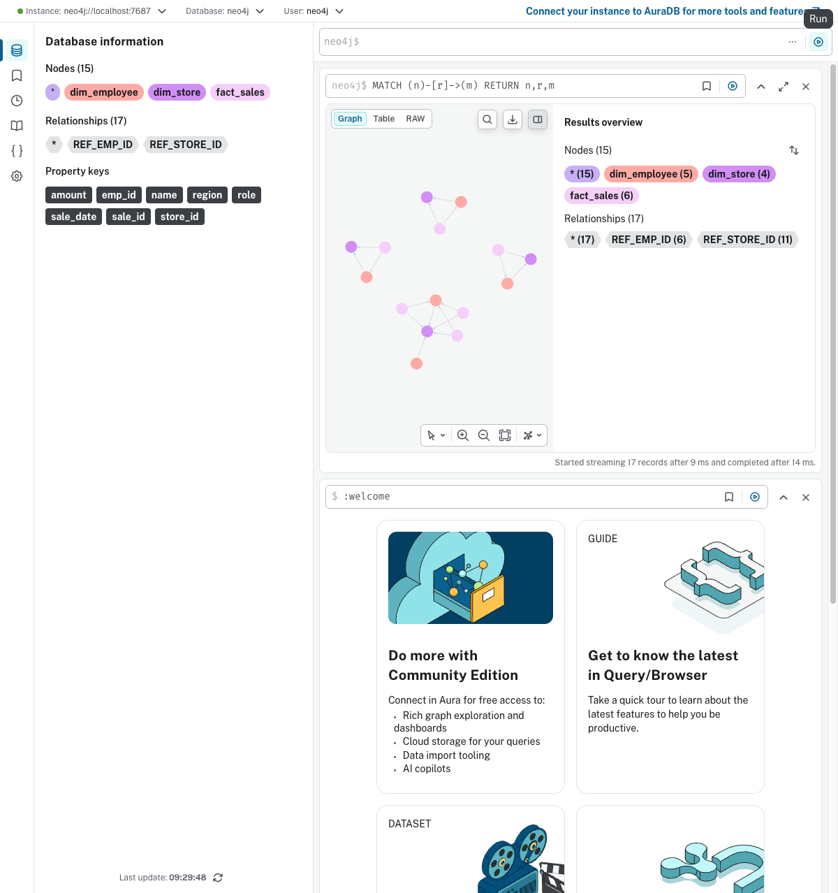

# Ontop 实测：从数据库自动生成虚拟知识图谱

> 完整记录 Ontop bootstrap → SPARQL 查询的端到端测试过程
> 测试时间：2026年3月

---

## 一、测试环境

| 组件 | 版本 | 说明 |
|------|------|------|
| Ontop CLI | 5.5.0 | 虚拟知识图谱引擎 |
| PostgreSQL | 16 (Alpine) | 测试数据库，Docker 运行 |
| PostgreSQL JDBC | 42.7.5 | Java 数据库驱动 |
| Java | OpenJDK 17.0.15 | Ontop 运行环境 |
| Docker | 28.3.2 | 运行 PostgreSQL 容器 |

---

## 二、测试数据

### 数据库 Schema

```sql
-- 门店维度表
CREATE TABLE dim_store (
    store_id INT PRIMARY KEY,
    name VARCHAR(100),
    region VARCHAR(50)
);

-- 员工维度表
CREATE TABLE dim_employee (
    emp_id INT PRIMARY KEY,
    name VARCHAR(100),
    role VARCHAR(50),
    store_id INT REFERENCES dim_store(store_id)
);

-- 销售事实表
CREATE TABLE fact_sales (
    sale_id INT PRIMARY KEY,
    emp_id INT REFERENCES dim_employee(emp_id),
    store_id INT REFERENCES dim_store(store_id),
    amount DECIMAL(10,2),
    sale_date DATE
);
```

### 测试数据

**dim_store（门店）**

| store_id | name | region |
|----------|------|--------|
| 1 | 华东旗舰店 | 华东 |
| 2 | 南京中心店 | 华东 |
| 3 | 广州天河店 | 华南 |
| 4 | 深圳南山店 | 华南 |

**dim_employee（员工）**

| emp_id | name | role | store_id |
|--------|------|------|----------|
| 101 | 张三 | 店长 | 1 |
| 102 | 李四 | 销售员 | 1 |
| 103 | 王五 | 销售员 | 2 |
| 104 | 赵六 | 店长 | 3 |
| 105 | 钱七 | 销售员 | 4 |

**fact_sales（销售记录）**

| sale_id | emp_id | store_id | amount | sale_date |
|---------|--------|----------|--------|-----------|
| 1001 | 102 | 1 | 1500.00 | 2026-03-01 |
| 1002 | 102 | 1 | 2300.00 | 2026-03-05 |
| 1003 | 103 | 2 | 800.00 | 2026-03-03 |
| 1004 | 104 | 3 | 3200.00 | 2026-03-02 |
| 1005 | 105 | 4 | 1100.00 | 2026-03-04 |
| 1006 | 102 | 1 | 900.00 | 2026-03-10 |

---

## 三、操作步骤

### Step 1: 启动 PostgreSQL

```bash
docker run -d --name ontop-postgres \
  -e POSTGRES_USER=admin \
  -e POSTGRES_PASSWORD=test123 \
  -e POSTGRES_DB=retail_db \
  -p 5433:5432 \
  postgres:16-alpine
```

### Step 2: 创建表并插入数据

```bash
docker exec ontop-postgres psql -U admin -d retail_db -c "
CREATE TABLE dim_store (store_id INT PRIMARY KEY, name VARCHAR(100), region VARCHAR(50));
CREATE TABLE dim_employee (emp_id INT PRIMARY KEY, name VARCHAR(100), role VARCHAR(50), store_id INT REFERENCES dim_store(store_id));
CREATE TABLE fact_sales (sale_id INT PRIMARY KEY, emp_id INT REFERENCES dim_employee(emp_id), store_id INT REFERENCES dim_store(store_id), amount DECIMAL(10,2), sale_date DATE);

INSERT INTO dim_store VALUES (1,'华东旗舰店','华东'),(2,'南京中心店','华东'),(3,'广州天河店','华南'),(4,'深圳南山店','华南');
INSERT INTO dim_employee VALUES (101,'张三','店长',1),(102,'李四','销售员',1),(103,'王五','销售员',2),(104,'赵六','店长',3),(105,'钱七','销售员',4);
INSERT INTO fact_sales VALUES (1001,102,1,1500.00,'2026-03-01'),(1002,102,1,2300.00,'2026-03-05'),(1003,103,2,800.00,'2026-03-03'),(1004,104,3,3200.00,'2026-03-02'),(1005,105,4,1100.00,'2026-03-04'),(1006,102,1,900.00,'2026-03-10');
"
```

### Step 3: 下载 Ontop CLI + JDBC 驱动

```bash
# 下载 Ontop CLI
curl -L -o ontop.zip "https://github.com/ontop/ontop/releases/download/ontop-5.5.0/ontop-cli-5.5.0.zip"
unzip -o ontop.zip -d ontop-cli

# 下载 PostgreSQL JDBC 驱动（必须放到 ontop-cli/jdbc/ 目录）
curl -L -o ontop-cli/jdbc/postgresql.jar "https://jdbc.postgresql.org/download/postgresql-42.7.5.jar"
```

### Step 4: 创建数据库连接配置

```properties
# output/retail.properties
jdbc.url=jdbc:postgresql://localhost:5433/retail_db
jdbc.user=admin
jdbc.password=test123
jdbc.driver=org.postgresql.Driver
```

### Step 5: Bootstrap — 一条命令自动生成本体 + 映射

```bash
./ontop-cli/ontop bootstrap \
  -b "http://example.com/retail/" \
  -p output/retail.properties \
  -t output/retail_ontology.ttl \
  -m output/retail_mapping.obda
```

**输出三个文件：**

| 文件 | 大小 | 内容 |
|------|------|------|
| retail_ontology.ttl | 2.9KB | OWL 本体（3 个类 + 14 个属性 + 3 个对象属性） |
| retail_mapping.obda | 3.9KB | 6 条映射规则（表→类，列→属性，外键→关系） |
| retail.properties | 124B | 数据库连接配置 |

### Step 6: 启动 SPARQL Endpoint

```bash
./ontop-cli/ontop endpoint \
  --ontology output/retail_ontology.ttl \
  --mapping output/retail_mapping.obda \
  --properties output/retail.properties \
  --port 8080
```

输出：`Ontop virtual repository initialized successfully!`

### Step 7: 启动 SPARQL Endpoint 并执行查询

```bash
# 启动 endpoint
./ontop-cli/ontop endpoint \
  --ontology output/retail_ontology.ttl \
  --mapping output/retail_mapping.obda \
  --properties output/retail.properties \
  --port 8080
```

查询示例（通过 HTTP API）：

```bash
# 查询 1：所有门店
curl -s 'http://localhost:8080/sparql' \
  -H 'Content-Type: application/sparql-query' \
  -d 'PREFIX : <http://example.com/retail/dim_store#>
PREFIX cls: <http://example.com/retail/>
SELECT ?store ?name ?region WHERE {
  ?store a cls:dim_store ; :name ?name ; :region ?region .
}'

# 查询 2：各门店销售总额
curl -s 'http://localhost:8080/sparql' \
  -H 'Content-Type: application/sparql-query' \
  -d 'PREFIX s: <http://example.com/retail/dim_store#>
PREFIX f: <http://example.com/retail/fact_sales#>
PREFIX cls: <http://example.com/retail/>
SELECT ?store_name (SUM(?amount) AS ?total_sales) WHERE {
  ?sale a cls:fact_sales ; f:amount ?amount ; f:store_id ?sid .
  ?store a cls:dim_store ; s:name ?store_name ; s:store_id ?sid .
} GROUP BY ?store_name ORDER BY DESC(?total_sales)'
```

### Step 8: 导出 RDF 三元组（Materialize）

```bash
./ontop-cli/ontop materialize \
  --ontology output/retail_ontology.ttl \
  --mapping output/retail_mapping.obda \
  --properties output/retail.properties \
  -f turtle \
  -o output/retail_exported.ttl
```

输出：94 条 RDF 三元组，从数据库实时导出。

### Step 9: 导入 Neo4j 知识图谱

```bash
# 启动 Neo4j 容器
docker run -d --name ontop-neo4j \
  -p 7474:7474 -p 7687:7687 \
  -e NEO4J_AUTH=neo4j/Test1234 \
  neo4j:5

# 运行导入脚本
pip install rdflib neo4j
python3 rdf_to_neo4j.py
```

导入结果：
- 15 个节点（dim_store:4, dim_employee:5, fact_sales:6）
- 17 条关系（REF_STORE_ID:11, REF_EMP_ID:6）

### Step 10: LangChain 自然语言问答（GraphRAG）

使用 LM Studio 本地模型 + Neo4j 实现"自然语言 → Cypher → 知识图谱查询 → 自然语言回答"。

```bash
pip install openai neo4j
python3 langchain_neo4j_test.py
```

**测试结果（5/5 全部正确）：**

| 用户提问 | 生成的 Cypher | 回答 |
|----------|---------------|------|
| 有哪些门店？ | `MATCH (s:dim_store) RETURN s.name` | 华东旗舰店、广州天河店、深圳南山店、南京中心店 |
| 华东旗舰店有多少员工？ | `MATCH (e:dim_employee)-[:REF_STORE_ID]->(s:dim_store{name:'华东旗舰店'}) RETURN count(e)` | 2名 |
| 哪个门店销售额最高？ | `MATCH (f:fact_sales)-[:REF_STORE_ID]->(s:dim_store) RETURN s.name,sum(f.amount) ORDER BY ... DESC LIMIT 1` | 华东旗舰店 ¥4700 |
| 李四经手的销售总额？ | `MATCH (e:dim_employee{name:'李四'})<-[:REF_EMP_ID]-(f:fact_sales) RETURN sum(f.amount)` | ¥4700 |
| 华南地区的门店有哪些员工？ | `MATCH (e:dim_employee)-[:REF_STORE_ID]->(s:dim_store{region:'华南'}) RETURN e.name` | 赵六、钱七 |

**技术架构：**

```
用户自然语言提问
       │
       ▼
 LM Studio (glm-4.7-flash 本地模型)
       │
       ├──生成 Cypher──→ Neo4j 图数据库 ──执行查询──→ 结果
       │                                                    │
       └──────── 生成自然语言回答 ◄──────────────────────────┘
```

---

## 四、Bootstrap 自动生成的本体

### 类（3 个，对应 3 张表）

```turtle
<http://example.com/retail/dim_store>     a owl:Class .   # 门店
<http://example.com/retail/dim_employee>  a owl:Class .   # 员工
<http://example.com/retail/fact_sales>    a owl:Class .   # 销售
```

### 数据属性（14 个，对应所有字段）

| 类 | 属性 | 类型 |
|----|------|------|
| dim_store | store_id | integer |
| dim_store | name | string |
| dim_store | region | string |
| dim_employee | emp_id | integer |
| dim_employee | name | string |
| dim_employee | role | string |
| dim_employee | store_id | integer |
| fact_sales | sale_id | integer |
| fact_sales | emp_id | integer |
| fact_sales | store_id | integer |
| fact_sales | amount | decimal |
| fact_sales | sale_date | date |

### 对象属性（3 个，自动从外键推导）

| 对象属性 | 含义 | 来源 |
|----------|------|------|
| dim_employee#ref-store_id | 员工→门店 | dim_employee.store_id FK → dim_store |
| fact_sales#ref-emp_id | 销售→员工 | fact_sales.emp_id FK → dim_employee |
| fact_sales#ref-store_id | 销售→门店 | fact_sales.store_id FK → dim_store |

### 映射规则示例（6 条中的 2 条）

```obda
# 规则: dim_store 表 → 门店类 + 所有属性
mappingId    MAPPING-ID6
target       <http://example.com/retail/dim_store/store_id={store_id}>
               a <http://example.com/retail/dim_store> ;
               <http://example.com/retail/dim_store#store_id> {store_id}^^xsd:integer ;
               <http://example.com/retail/dim_store#name> {name}^^xsd:string ;
               <http://example.com/retail/dim_store#Region> {region}^^xsd:string .
source       SELECT * FROM "dim_store"

# 规则: 外键关联（员工→门店）
mappingId    MAPPING-ID2
target       <http://example.com/retail/dim_employee/emp_id={dim_employee_emp_id}>
               <http://example.com/retail/dim_employee#ref-store_id>
               <http://example.com/retail/dim_store/store_id={dim_store_store_id}> .
source       SELECT "dim_employee"."emp_id" AS "dim_employee_emp_id",
                    "dim_store"."store_id" AS "dim_store_store_id"
             FROM "dim_employee", "dim_store"
             WHERE "dim_employee"."store_id" = "dim_store"."store_id"
```

**关键发现**：外键关系被自动识别，生成了 JOIN 查询的映射规则。

---

## 五、SPARQL 查询测试结果

### 查询 1: 所有门店及区域

```sparql
PREFIX : <http://example.com/retail/dim_store#>
PREFIX cls: <http://example.com/retail/>
SELECT ?store ?name ?region WHERE {
  ?store a cls:dim_store ;
         :name ?name ;
         :region ?region .
}
```

**Ontop 翻译成的 SQL（等效）：**

```sql
SELECT dim_store.store_id, dim_store.name, dim_store.region
FROM dim_store
WHERE dim_store.name IS NOT NULL AND dim_store.region IS NOT NULL
```

**查询结果：**

| store | name | region |
|-------|------|--------|
| dim_store/store_id=1 | 华东旗舰店 | 华东 |
| dim_store/store_id=2 | 南京中心店 | 华东 |
| dim_store/store_id=3 | 广州天河店 | 华南 |
| dim_store/store_id=4 | 深圳南山店 | 华南 |

---

### 查询 2: 华东门店的员工（跨表 JOIN + FILTER）

```sparql
PREFIX s: <http://example.com/retail/dim_store#>
PREFIX e: <http://example.com/retail/dim_employee#>
PREFIX cls: <http://example.com/retail/>
SELECT ?emp_name ?role ?store_name ?region WHERE {
  ?store a cls:dim_store ;
         s:name ?store_name ;
         s:region ?region ;
         s:store_id ?sid .
  ?emp a cls:dim_employee ;
       e:name ?emp_name ;
       e:role ?role ;
       e:store_id ?sid .
  FILTER (?region = "华东")
}
```

**Ontop 翻译成的 SQL（等效）：**

```sql
SELECT e.name, e.role, s.name, s.region
FROM dim_employee e
JOIN dim_store s ON e.store_id = s.store_id
WHERE s.region = '华东'
```

**查询结果：**

| emp_name | role | store_name | region |
|----------|------|------------|--------|
| 张三 | 店长 | 华东旗舰店 | 华东 |
| 李四 | 销售员 | 华东旗舰店 | 华东 |
| 王五 | 销售员 | 南京中心店 | 华东 |

---

### 查询 3: 各门店销售总额（JOIN + GROUP BY + SUM + ORDER BY）

```sparql
PREFIX s: <http://example.com/retail/dim_store#>
PREFIX f: <http://example.com/retail/fact_sales#>
PREFIX cls: <http://example.com/retail/>
SELECT ?store_name (SUM(?amount) AS ?total_sales) WHERE {
  ?sale a cls:fact_sales ;
        f:amount ?amount ;
        f:store_id ?sid .
  ?store a cls:dim_store ;
         s:name ?store_name ;
         s:store_id ?sid .
} GROUP BY ?store_name ORDER BY DESC(?total_sales)
```

**Ontop 翻译成的 SQL（等效）：**

```sql
SELECT s.name, SUM(f.amount) AS total_sales
FROM fact_sales f
JOIN dim_store s ON f.store_id = s.store_id
GROUP BY s.name
ORDER BY total_sales DESC
```

**查询结果：**

| store_name | total_sales |
|------------|-------------|
| 华东旗舰店 | 4700.00 |
| 广州天河店 | 3200.00 |
| 深圳南山店 | 1100.00 |
| 南京中心店 | 800.00 |

---

## 六、对比：手工 SQL vs SPARQL

| 维度 | SQL（传统方式） | SPARQL（Ontop 虚拟知识图谱） |
|------|-----------------|------------------------------|
| 查询语言 | SQL | SPARQL |
| 表名 | dim_store, fact_sales | :dim_store, :fact_sales（语义化的类名） |
| 字段名 | name, region, amount | :name, :region, :amount（语义化的属性名） |
| 表关联 | JOIN dim_store ON ... | ?store s:store_id ?sid . ?sale f:store_id ?sid |
| 过滤 | WHERE region = '华东' | FILTER (?region = "华东") |
| 聚合 | GROUP BY + SUM | GROUP BY + SUM（语法相同） |
| 数据库依赖 | 绑定特定数据库 schema | 通过映射层解耦，可替换数据源 |
| 语义一致性 | 不同系统可能同名不同义 | 本体统一定义，语义唯一 |

---

## 七、Neo4j 图查询结果

### Cypher 查询 1: 门店 ← 员工

```cypher
MATCH (e:dim_employee)-[:REF_STORE_ID]->(s:dim_store)
RETURN e.name AS emp, s.name AS store ORDER BY s.name
```

| 员工 | 门店 |
|------|------|
| 张三 | 华东旗舰店 |
| 李四 | 华东旗舰店 |
| 王五 | 南京中心店 |
| 赵六 | 广州天河店 |
| 钱七 | 深圳南山店 |

### Cypher 查询 2: 各门店销售额

```cypher
MATCH (f:fact_sales)-[:REF_STORE_ID]->(s:dim_store)
RETURN s.name AS store, sum(f.amount) AS total, count(f) AS orders
ORDER BY total DESC
```

| 门店 | 销售额 | 订单数 |
|------|--------|--------|
| 华东旗舰店 | ¥4,700.00 | 3 |
| 广州天河店 | ¥3,200.00 | 1 |
| 深圳南山店 | ¥1,100.00 | 1 |
| 南京中心店 | ¥800.00 | 1 |

### Cypher 查询 3: 多跳遍历（门店 ← 员工 ← 销售）

```cypher
MATCH (f:fact_sales)-[:REF_EMP_ID]->(e:dim_employee)-[:REF_STORE_ID]->(s:dim_store)
RETURN s.name AS store, e.name AS emp, f.amount AS amount
ORDER BY s.name, e.name
```

| 门店 | 员工 | 金额 |
|------|------|------|
| 华东旗舰店 | 李四 | ¥1,500 |
| 华东旗舰店 | 李四 | ¥2,300 |
| 华东旗舰店 | 李四 | ¥900 |
| 广州天河店 | 赵六 | ¥3,200 |
| 南京中心店 | 王五 | ¥800 |
| 深圳南山店 | 钱七 | ¥1,100 |

### 可视化

在 Neo4j Browser（http://localhost:7474）中执行 `MATCH (n)-[r]->(m) RETURN n,r,m` 可查看完整知识图谱：



**图结构说明**：
- **dim_store** 节点（4 个）：华东旗舰店、南京中心店、广州天河店、深圳南山店
- **dim_employee** 节点（5 个）：通过 `REF_STORE_ID` 连接到所属门店
- **fact_sales** 节点（6 个）：通过 `REF_EMP_ID` 连接到经手员工，通过 `REF_STORE_ID` 连接到门店

---

## 八、与 Fabric IQ 的对应关系

| Fabric IQ 步骤 | Ontop 等价操作 | 是否自动 |
|----------------|---------------|---------|
| 创建本体 | `ontop bootstrap` 生成 .ttl | ✅ 自动 |
| 定义实体类型 | 从表自动生成 OWL Class | ✅ 自动 |
| 定义属性 | 从列自动生成 DatatypeProperty | ✅ 自动 |
| 设置主键 | 自动识别 PRIMARY KEY | ✅ 自动 |
| 数据绑定 | 自动生成 .obda 映射规则 | ✅ 自动 |
| 定义关系 | 自动从外键生成 ObjectProperty | ✅ 自动 |
| 配置规则 | OWL 2 QL 内置推理 | ✅ 内置 |
| 预览验证 | SPARQL endpoint 查询 | ✅ 自动 |
| 图引擎 | 虚拟知识图谱（非实体图） | ⚠️ 需导出到 Neo4j |
| Data Agent | 需对接 LangChain | ❌ 需手动集成 |

---

## 九、关键结论

1. **一条命令完成 Fabric IQ 三个阶段的工作**：`ontop bootstrap` 自动完成了"定义实体类型 → 数据绑定 → 建立关系"
2. **外键自动推导为关系**：dim_employee.store_id → dim_store 的外键被自动识别为对象属性
3. **SPARQL 被实时翻译为 SQL**：查询性能取决于底层数据库，Ontop 不存储数据
4. **缺少的部分**：自然语言交互（需 LangChain）、规则引擎（OWL 2 QL 推理能力有限）
5. **Neo4j 图遍历验证成功**：SPARQL 不支持的图遍历在 Neo4j 中通过 Cypher 实现，验证了完整的 PostgreSQL → Ontop → Neo4j 管线

---

## 十、清理

```bash
# 停止 SPARQL endpoint
kill $(lsof -ti:8080)

# 停止并删除容器
docker stop ontop-postgres ontop-neo4j
docker rm ontop-postgres ontop-neo4j
```

---

## 附录：完整端到端管线

```
PostgreSQL ──ontop bootstrap──→ OWL 本体 (.ttl) + 映射规则 (.obda)
       │
       ├──ontop endpoint──→ SPARQL Endpoint (:8080) ──实时查询──→ SQL
       │
       └──ontop materialize──→ RDF 三元组 (.ttl) ──Python 解析──→ Neo4j 图数据库
                                                                      │
                                                                      ├── Cypher 图查询
                                                                      └── Browser 可视化
```

## 附录：LangChain 集成（自然语言 → 知识图谱）

### 方案 1：Neo4j + LangChain（GraphCypherQAChain）

适合图遍历、多跳查询场景。

```python
from langchain_community.graphs import Neo4jGraph
from langchain.chains import GraphCypherQAChain
from langchain_openai import ChatOpenAI

# 连接 Neo4j
graph = Neo4jGraph(
    url="bolt://localhost:7687",
    username="neo4j",
    password="Test1234"
)

# 自然语言 → Cypher → 查询 → 自然语言回答
chain = GraphCypherQAChain.from_llm(
    ChatOpenAI(model="gpt-4"),
    graph=graph,
    verbose=True
)

# 示例交互
chain.invoke("华东旗舰店有多少员工？")
# → MATCH (e:dim_employee)-[:REF_STORE_ID]->(s:dim_store {name:'华东旗舰店'}) RETURN count(e)
# → "华东旗舰店有2名员工"

chain.invoke("哪个门店销售额最高？")
# → MATCH (f:fact_sales)-[:REF_STORE_ID]->(s:dim_store) RETURN s.name, sum(f.amount) ORDER BY sum(f.amount) DESC LIMIT 1
# → "华东旗舰店销售额最高，总计4700元"
```

### 方案 2：Ontop SPARQL + LangChain（SparqlQAChain）

适合实时查询，数据零复制。

```python
from langchain_community.utilities import SPARQLWrapper
from langchain.chains import SparqlQAChain
from langchain_openai import ChatOpenAI

# 连接 Ontop SPARQL endpoint
sparql = SPARQLWrapper("http://localhost:8080/sparql")

chain = SparqlQAChain.from_llm(
    ChatOpenAI(model="gpt-4"),
    sparql=sparql,
    verbose=True
)

chain.invoke("哪个门店销售额最高？")
# → SPARQL 查询 → Ontop 翻译成 SQL → PostgreSQL 执行 → 返回结果
```

### 方案 3：双路径路由（推荐）

根据问题类型自动选择查询路径：

```python
from langchain_openai import ChatOpenAI
from langchain_community.graphs import Neo4jGraph
from langchain.chains import GraphCypherQAChain
from SPARQLWrapper import SPARQLWrapper, JSON

llm = ChatOpenAI(model="gpt-4")

# 路由提示词
ROUTE_PROMPT = """判断以下问题应该用哪种方式查询：
- "cypher": 涉及关系遍历、路径查找、邻居查询（如"谁和谁有关系"、"经过哪些节点"）
- "sparql": 涉及聚合统计、筛选排序（如"销量最高的"、"总共有多少"）

问题: {question}
回答(cypher/sparql):"""

def query(question: str) -> str:
    # 1. 路由判断
    route = llm.invoke(ROUTE_PROMPT.format(question=question)).content.strip().lower()

    if "cypher" in route:
        # 2a. 图遍历 → Neo4j
        graph = Neo4jGraph(url="bolt://localhost:7687", username="neo4j", password="Test1234")
        chain = GraphCypherQAChain.from_llm(llm, graph=graph)
        return chain.invoke(question)
    else:
        # 2b. 聚合查询 → Ontop → PostgreSQL（实时，零复制）
        sparql = SPARQLWrapper("http://localhost:8080/sparql")
        chain = SparqlQAChain.from_llm(llm, sparql=sparql)
        return chain.invoke(question)
```

### 完整架构图

```
用户自然语言提问
       │
       ▼
   LangChain (LLM 路由)
       │
       ├──聚合/统计──→ SPARQL → Ontop → SQL → PostgreSQL（实时，零复制）
       │
       └──图遍历/关系──→ Cypher → Neo4j（实体图谱，支持多跳遍历）
       │
       ▼
   自然语言回答
```

### 依赖安装

```bash
pip install langchain langchain-openai langchain-community neo4j SPARQLWrapper
```

### 对比

| 维度 | 方案 1（Neo4j） | 方案 2（Ontop SPARQL） | 方案 3（双路由） |
|------|-----------------|----------------------|-----------------|
| 数据 | 需导入 Neo4j | 零复制，实时查 PostgreSQL | 两者并存 |
| 擅长 | 图遍历、路径、邻居 | 聚合、筛选、排序 | 全覆盖 |
| 延迟 | 低（内存图） | 取决于数据库 | 自动选最优 |
| 数据新鲜度 | 需重新导入 | 实时 | SPARQL 路径实时 |
| 复杂度 | 低 | 中 | 高（需路由逻辑） |

---

## 附录：文件结构

```
ontop-test/
├── ontop-cli/                        # Ontop CLI 工具
│   ├── bin/ontop                     # 主程序
│   └── jdbc/postgresql.jar           # JDBC 驱动
├── output/
│   ├── retail_ontology.ttl           # 自动生成的 OWL 本体
│   ├── retail_mapping.obda           # 自动生成的映射规则
│   ├── retail_exported.ttl           # Materialize 导出的 RDF 三元组
│   └── retail.properties             # 数据库连接配置
├── rdf_to_neo4j.py                   # RDF → Neo4j 导入脚本
├── langchain_neo4j_test.py           # LM Studio + Neo4j 自然语言问答脚本
├── langchain_neo4j_test.py           # 自然语言 → Cypher → Neo4j 问答测试
├── neo4j-graph-visualization.png     # Neo4j 图谱可视化截图
├── neo4j-graph-zoomfit.png           # 缩放适配视图截图
└── README.md                         # 本文件
```
